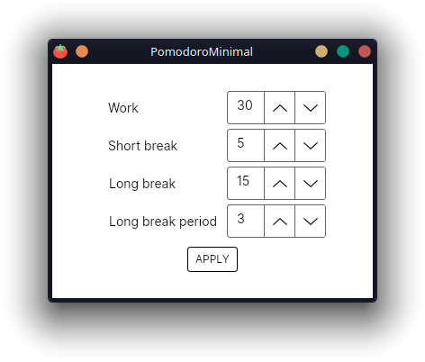
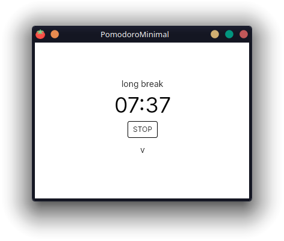

# Pomodoro Minimal

Simple, clean, and configurable tool for your productivity.

## What is Pomodoro?

The Pomodoro Technique is a time management system designed for increased productivity. You interleave your work sessions with short breaks to keep your attention to maximum, sometimes opting for longer breaks to unwind for a bit so you can focus once the time for work comes again. The most common model suggest 25 minutes for work, 5 minutes for short breaks, and 15 minutes for long ones, which occur after three short breaks. This is just a rule of thumb, and with Pomodoro Minimal you can figure out what works best for you.

## Say no to distractions

Pomodoro Minimal offers minimalistic interface so you can focus on what is important. 

Furthermore, if any distracting thought comes to your attention, the program offers you a way to note it down in order not to hinder your attention but also not to lose an interesting idea that your working brain might have produced. With a mere click of a button, a text box appears for you to write a note in and with the next click, it disappears. The notes are stored in the file `distractions.txt` which is located in the same directory as your executable. Feel free to edit the code and insert your own path.

What are you waiting for? The mighty Pomodoro awaits you!

